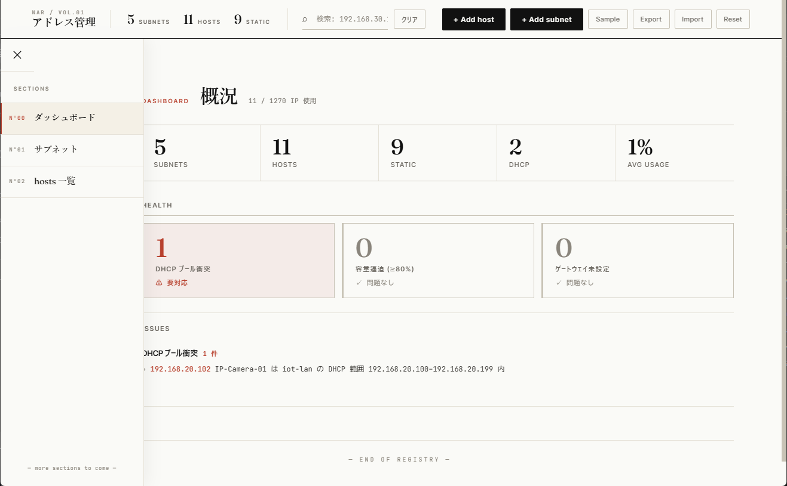

# ネットワークアドレス管理表

ホームネットワークの IP アドレス・サブネット情報を一覧管理するシングルページアプリです。
ビルド不要・依存ライブラリなし。`index.html` をブラウザで開くだけで動作します。



---

## 機能

| 機能 | 説明 |
|---|---|
| キーワード検索 | IP / 名称 / 役割 / ネットワークID / 割当 / メモ の全列を対象にリアルタイム絞り込み |
| ネットワークフィルタ | フィルタチップで特定サブネットのホストだけを表示 |
| ソート | 列ヘッダクリックで昇順・降順切替（IP はオクテット数値比較） |
| ホスト CRUD | `+ Add host` から追加 / 行の「編集」「削除」で更新（IP 重複・CIDR 範囲チェック付き） |
| サブネット CRUD | `+ Add subnet` から追加 / 行の「編集」「削除」で更新（CIDR・Gateway・VLAN・DHCP 範囲をバリデーション） |
| サブネット一覧 | ID・CIDR・Gateway・VLAN・DHCP 範囲をテーブル表示 |
| 集計 | Subnets / Hosts / Static の件数をリアルタイムで集計 |
| Sample | サンプルデータを投入（初回起動や動作確認用） |
| Export | 現在のデータを JSON ファイルとしてダウンロード |
| Import | JSON ファイルを読み込んで現在のデータを置き換え |
| Reset | 全データを削除して空の状態に戻す |

---

## 使い方

### 起動

```
index.html をブラウザで開く
```

ローカルファイルとして直接開けます。サーバー不要です。

### 初回起動

データは**空の状態**で起動します。トップバーの操作で投入してください。

- **Sample** ボタン — `index.html` 内に埋め込まれたサンプルデータを一括投入
- **+ Add subnet** / **+ Add host** — モーダルから 1 件ずつ追加
- **Import** — エクスポート済み JSON を読み込み

### データの永続化

UI で追加・編集・削除した内容は、ブラウザの **localStorage**（キー: `nar:v1`）に自動保存されます。
ページをリロードしても変更は保持されます。同じブラウザで開いている限りデータは残ります。

| 操作 | 結果 |
|---|---|
| ホスト・サブネットの追加／編集／削除 | localStorage に即時保存 |
| ページリロード | localStorage の内容を復元（空なら空のまま起動） |
| **Sample** ボタン | サンプルデータを読み込み localStorage に保存 |
| **Reset** ボタン | localStorage を破棄して空の状態に戻す |

### 別環境への移行・バックアップ

トップバーの **Export / Import** ボタンを使います。

- **Export** — 現在のデータを `address-manage-YYYYMMDD-HHMMSS.json` としてダウンロード
- **Import** — JSON ファイルを選択 → 件数を確認するダイアログ → 現在のデータを置換

エクスポートされる JSON は `index.html` の埋め込みサンプルデータと同じスキーマなので、必要に応じて `<script id="ipData">` の中身に貼り付けて Sample ボタンで投入される内容を更新することもできます。

**JSON スキーマ:**

```json
{
  "networks": [
    {
      "id": "core-lan",
      "cidr": "192.168.1.0/24",
      "vlan_id": 1,
      "gateway": "192.168.1.1",
      "dhcp": {
        "enabled": true,
        "range": { "start": "192.168.1.100", "end": "192.168.1.199" }
      }
    }
  ],
  "hosts": [
    {
      "ip": "192.168.1.10",
      "name": "Desktop-PC",
      "role": "Main-PC",
      "network_id": "core-lan",
      "assign": "static",
      "note": "メイン作業機"
    }
  ]
}
```

---

## ファイル構成

```
AddressManageTable/
├── index.html   # アプリ本体 + 埋め込みサンプルデータ (JSON)
├── style.css    # スタイルシート
└── app.js       # アプリケーションロジック
```

---

## 技術スタック

- **HTML / CSS / JavaScript** — フレームワーク・ビルドツール不使用
- **フォント** — Fraunces（見出し）・Inter Tight（本文）・JetBrains Mono（データ表示）via Google Fonts
- **永続化** — ブラウザ localStorage（外部 API・バックエンドなし）

---

## 注意事項

- 永続化は localStorage のみです。**ブラウザを変えると別のデータセットになります**。複数端末で同期したい場合は Export / Import を使ってください
- localStorage はブラウザのプライベートモードやストレージクリアで消えます。重要なデータは Export でバックアップを取ることを推奨します
- Google Fonts の読み込みにはインターネット接続が必要です（オフライン時はシステムフォントにフォールバックします）
